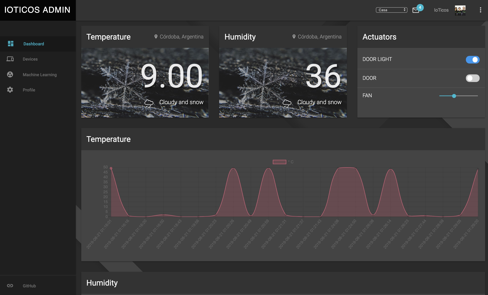

[![Contributors][contributors-shield]][contributors-url]
[![Forks][forks-shield]][forks-url]
[![Stargazers][stars-shield]][stars-url]
![Downloads][down-shield]

<!-- MARKDOWN LINKS & IMAGES -->
<!-- https://www.markdownguide.org/basic-syntax/#reference-style-links -->
[contributors-shield]: https://img.shields.io/github/contributors/ioticos/ioticos_admin?style=plastic
[contributors-url]: https://github.com/ioticos/ioticos_admin/graphs/contributors
[forks-shield]: https://img.shields.io/github/forks/ioticos/ioticos_admin?label=Fork&style=plastic
[forks-url]: https://github.com/ioticos/ioticos-admin/network/members
[stars-shield]: https://img.shields.io/github/stars/ioticos/ioticos_admin?style=plastic
[stars-url]: https://github.com/ioticos/ioticos_admin/stargazers
[down-shield]: https://img.shields.io/github/downloads/ioticos/ioticos_admin/total?style=plastic

<!-- PROJECT LOGO -->
 

  

  <h1 align="center">IoTicos Admin</h1>

  

    Un emprendimiento IoT en pocos clics
     
    <a href="https://github.com/github_username/repo"><strong>Explore the docs »</strong></a>
     
     
    <a href="https://ioticosadmin.ml/app/">Ingresa a la demo</a>
    ·
    <a href="https://github.com/ioticos/ioticos_admin/issues">Report Bug</a>
    ·
    <a href="https://github.com/ioticos/ioticos_admin/issues">Request Feature</a>
  

<!-- TABLE OF CONTENTS -->
## Contenido

* [Sobre el Proyecto](#sobre-el-proyecto)
* [Recomendaciones y Advertencias](#recomendaciones-y-advertencias)
* [Instalación](#Instalación)
* [Configuración](#Configuración)

<!-- ABOUT THE PROJECT -->
## Sobre el proyecto:

  

IoTicos Admin, es una plataforma IoT desarrolada en PHP bajo el framework Codeigniter. 

Ioticos Admin, te permitirá en pocos pasos, tener un sistema IoT corriendo en cualquier servicio hosting de mínimas prestaciones. 

La plataforma puede mostrar datos en tiempo real desde tus dispositivos mediante el broker MQTT de <a href="https://ioticos.org">IoTicos.com</a>  

Por otro lado tendrás tu propia base de datos (MySql) tanto para acumular los datos que envían tus dispositivos, como para llevar la gestión de usuarios. 

**IMPORTANTE:** No dejes de ver el proyecto para esp32 para usar con esta plataforma.   

### Recomendaciones y Advertencias:

* [Será de mucha utilidad que te familiarices con el Framework CodeIgniter]
* [El proyecto se en cuentra en plena etapa de desarrollo, contamos con tu ayuda para mejorarlo]

<!-- GETTING STARTED -->
## Instalación: (Actualización 31 de enero.)

Actualmente hay 2 formas de instalación:
* 1 - La que requiere un hosting tipo https://www.000webhost.com/ [LINK](https://github.com/ioticos/ioticos_admin/blob/master/INSTALL_HOSTING.md)
* 2 - Docker vino a quedarse [LINK](https://github.com/ioticos/ioticos_admin/blob/master/INSTALL_DOCKER.md) 

###  Ioticos Admin Colaboradores 

* Pablo
* Gabi
* Benja
* Federico Pereira [github](https://github.com/lordbasex)

Project Link: [https://github.com/ioticos/ioticos_admin](https://github.com/ioticos/ioticos_admin)

